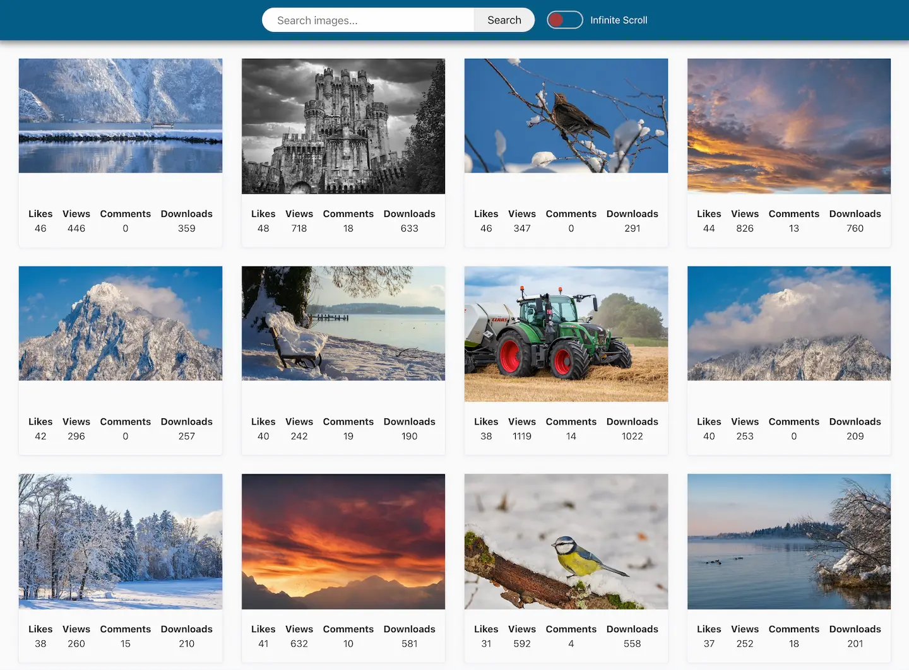

# PicFindr 🌄 [](https://app.netlify.com/sites/pic-findr/deploys) [🌐 Link](https://pic-findr.netlify.app/)

📸 PicFindr 🎨 is your one-stop destination for all things images, providing an
extensive collection and keeping you updated with the latest visual
discoveries🔍.



## Table of Contents

- [Description](#description)
- [Technologies Used](#technologies-used)
- [Key Features](#key-features)
- [Getting Started](#getting-started)
- [Usage](#usage)

## Description

PicQuest is designed to be your ultimate platform for exploring and discovering
images. Whether you're seeking high-quality photos, searching for artistic
inspiration, or curating your image collection, PicQuest caters to your needs.
With its user-friendly interface, navigate through various categories to find
the perfect images.

## Technologies Used

I used the following technologies to create an engaging and responsive website:

- HTML
- CSS
- JavaScript
- Axios
- Notiflix
- Simplelightbox
- Parcel

To optimize the project, I used Parcel to combine and optimize resources,
ensuring an uninterrupted user experience.

## Key Features

- **Image Search**: Users can effortlessly find their desired images.
- **Dynamic Search**: The search system enables quick and accurate image
  retrieval.

## Getting Started

To begin exploring PicFindr, follow these steps:

1. Clone the repository:
   ```bash
   git clone https://github.com/vasylkivt/PicFindr.git
   ```
2. Navigate to the project folder:
   ```bash
   cd PicFindr
   ```
3. Ensure the LTS version of Node.js is installed on your computer.
   [Download and install](https://nodejs.org/en/) it if necessary.
4. Install dependencies:
   ```bash
   npm install
   ```
5. Start the development server:
   ```bash
   npm start
   ```
6. Open your web browser and visit http://localhost:1234.

The page will automatically refresh upon saving changes to project files.

## Usage

Explore the website's functionalities, discover diverse image collections, and
experience its responsiveness. Use this project as a reference for implementing
similar features in your endeavors.
